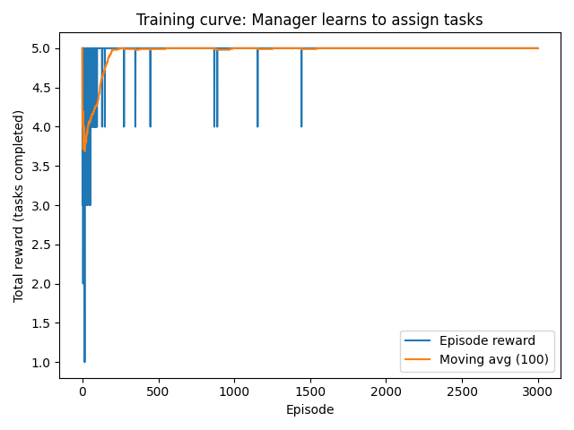

## Future Capabilities of AI Agents and Their Potential to Replace Human Work

### 1. Future Capabilities of AI
Over the next two decades, AI agents may acquire advanced capabilities that enable them to perform a wide range of tasks traditionally carried out by human workers. A plausible future scenario is one in which a single human supervisor oversees an organization largely operated by AI agents. These agents could autonomously handle operations such as human resources management, customer support, logistics coordination, data analytics, and marketing. Some commentators have even suggested the possibility of AI systems serving as executive-level decision-makers within highly automated enterprises.

The societal implications of such capabilities are substantial. Organizations might operate continuously with increased efficiency, improved real-time decision making, and significantly reduced labor costs. At the same time, automation of this scale could cause notable labor market shifts, particularly for entry-level knowledge workers. As AI systems take on management-level responsibilities, ensuring alignment with human values and establishing appropriate governance mechanisms becomes essential.

---

### 2. Required Components and Resources

#### (1) Data Requirements
Realizing this type of organizational AI capability requires diverse and high-quality data, including:

- Structured operational data (e.g., workforce metrics, sales patterns, inventory data)
- Unstructured text sources (e.g., emails, customer service transcripts, meeting notes)
- Multimodal signals such as images, audio recordings, and behavioral logs
- Real-time feedback (e.g., customer satisfaction scores, conversion rates, key performance indicators)

Continuous, large-scale, and up-to-date data streams are essential for effective adaptation.

---

#### (2) Algorithms and Tools
Essential technologies include:

- **Decision Transformer and sequence-modeling methods** for long-horizon planning  
- **Multi-Agent Reinforcement Learning (MARL)** to coordinate multiple AI agents in collaborative settings  
- **Symbolic reasoning and causal inference techniques** to improve decision reliability and interpretability  
- **Optimization algorithms** for constrained scheduling, resource allocation, and workflow planning  

---

#### (3) Hardware and System Environment
- Cloud-based GPU/TPU clusters for large-scale agent training  
- Integration pipelines connecting AI agents to enterprise systems (ERP, CRM, databases, APIs)  
- Optional edge-based inference for latency-sensitive tasks  
- Security protocols and access-control systems to protect sensitive organizational data  

---

#### (4) Learning Setup
The learning framework may incorporate:

- **Reinforcement Learning (RL)** for learning through direct interaction with an environment  
- **Reinforcement Learning from Human Feedback (RLHF)** to align behavior with human preferences  
- **Supervised imitation learning** to initialize models with human-like decision patterns  
- **Continual and online learning** to ensure adaptability in changing operational conditions  

The interplay between these components enables a robust, adaptive AI management system.

---

### 3. Machine Learning Paradigms Involved
Reinforcement Learning is the most suitable paradigm for the envisioned AI managerial capability. Organizational decision-making is inherently sequential, uncertain, and often lacks ground-truth labels—conditions under which RL excels.

- **State:** Organizational conditions (inventory, resource availability, employee workload)  
- **Actions:** Task assignments, scheduling decisions, parameter adjustments  
- **Rewards:** Profitability, operational efficiency, stability, customer satisfaction  

Supervised learning can support pre-training, and unsupervised learning can uncover latent structure in organizational data, but RL is essential for optimizing behavior through trial and feedback.

---

### 4. Solvable Model Problem: AI Manager Allocating Tasks to AI Workers

#### 4.1 Problem Design
To illustrate the feasibility of AI-driven task allocation, we design a simplified reinforcement-learning environment in which a manager agent assigns tasks to workers.

The environment includes:

- One **manager agent**  
- Three **workers** with fixed skill levels  
- Five **tasks**, each with a difficulty value  

The manager observes:

- Current task difficulty  
- Worker skill levels  
- Task progress within the episode  

The manager selects one worker for each task.  
If `worker_skill ≥ task_difficulty`, the task succeeds (+1 reward); otherwise, it fails.

---

#### 4.2 Modeling Approach
A policy-gradient reinforcement learning agent (REINFORCE) is used:

- A neural network maps states to action probabilities  
- Categorical sampling allows exploration during training  
- Policy updates use discounted returns to improve decision quality  

---

#### 4.3 Results and Visualization
During training, we record:

- Episode rewards (number of successfully completed tasks)  
- A moving average over 100 episodes  
- Evaluated performance using a greedy (argmax) policy  

---

#### 4.4 Discussion
The simplified model demonstrates:

1. **AI agents can acquire meaningful allocation strategies** through reinforcement learning.  
2. **Structured environments facilitate rapid convergence** to optimal behavior.  
3. **The experiment provides a scaled-down example of how AI managers may guide AI workers** in real organizations.

This serves as preliminary evidence supporting the broader idea that AI agents could eventually perform coordination and management functions traditionally carried out by humans.

---

### 5. Experimental Results (Baseline vs RL)

#### Baseline (Untrained)
With random assignment, the expected average success rate is:

**Baseline ≈ 2.5 / 5 tasks completed**

---

#### RL-Trained Performance
After training for 3000 episodes:

**Evaluate = 5.00 / 5**

The agent reliably assigns:

- Low-difficulty tasks to any worker  
- Medium-difficulty tasks to mid- or high-skill workers  
- High-difficulty tasks exclusively to the highest-skill worker  

This reflects full mastery of the task allocation structure.

---

#### Training Curve

Key observations:

- Early episodes fluctuate, reflecting exploration  
- Rapid learning occurs around episodes 200–300  
- Performance stabilizes at 5/5, indicating consistent optimal allocation  

---

### Summary
This experiment demonstrates that:

- Reinforcement Learning is highly effective in learning structured allocation strategies  
- AI managers can coordinate AI workers in a controlled environment  
- The results provide a conceptual foundation for future AI-driven organizational systems  
